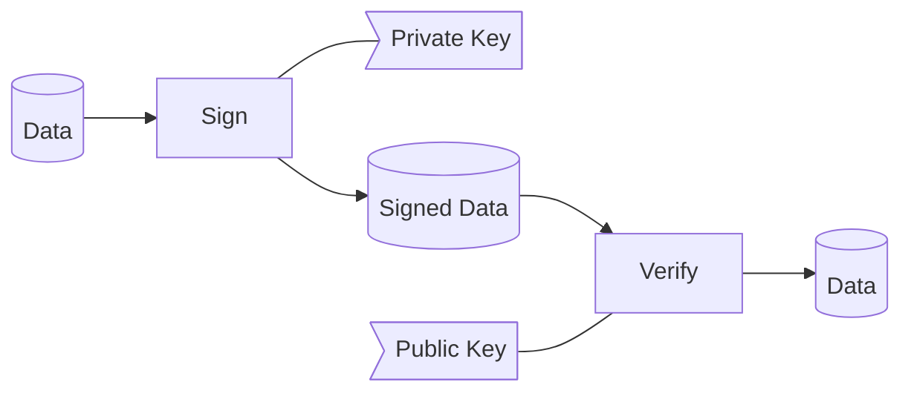

# roblox-signer

Small PHP library for signing Roblox Lua scripts using the official format:

- Sign with SHA‑1 over `\r\n` + script
- Base64‑encode the signature
- Wrap with `%...%`
- Add `--rbxsig` prefix for newer clients

Supports multiple client eras via a simple string parameter.

For background on Roblox script signatures and security, see:
- https://github.com/ROBLOX-Reverse-Engineering/RRE-Site/blob/master/docs/Client%20Security/Signatures.md

## How signing works (conceptual)

This graph demonstrates the signing process conceptionally:[^2]



[^2]: Adapted from Roblox Reverse Engineering documentation.

In practice for Roblox scripts:

- **Data** = `\r\n` + Lua script source
- **Sign** = RSA + SHA‑1 using your `PrivateKey.pem`
- **Signed Data** = base64-encoded signature wrapped as `%...%` or `--rbxsig%...%`
- **Verify** = Roblox client/server using the matching public key

## Requirements

- PHP 8.0+
- `openssl` extension

## Installation

```bash
composer require 0cal1/rbx-signer
```

Adjust the package name to match your `composer.json`.

## Basic usage

```php
<?php

require 'vendor/autoload.php';

use RobloxSigner\Signer;

$script = file_get_contents('script.lua');
$key    = 'keys/PrivateKey.pem';

// Default: modern era (2013+), i.e. "--rbxsig%...%"
$signed = Signer::sign($script, $key);

header('Content-Type: text/plain');
echo $signed;
```

## Eras

The third argument selects the signature format:

```php
// Pre-2012 clients: "%...%"
$signed = Signer::sign($script, $key, 'pre_2012');

// 2013+ clients (typical): "--rbxsig%...%"
$signed = Signer::sign($script, $key, 'v2013');
$signed = Signer::sign($script, $key, 'v2017');
$signed = Signer::sign($script, $key, 'v2019');
```

All non-`pre_2012` eras use the same `--rbxsig%...%` format; they’re provided as named options for clarity.

## Example HTTP endpoint

`tests/sign-script.php`:

```php
<?php

declare(strict_types=1);

require_once __DIR__ . '/../vendor/autoload.php';

use RobloxSigner\Signer;

$privateKeyPath = __DIR__ . '/../keys/PrivateKey.pem';
$scriptPath     = __DIR__ . '/../scripts/example.lua';
$era            = 'v2019'; // 'pre_2012', 'v2013', 'v2017', or 'v2019'

$scriptContent = file_get_contents($scriptPath);
if ($scriptContent === false) {
    http_response_code(500);
    exit("Script not found\n");
}

header('Content-Type: text/plain');

try {
    echo Signer::sign($scriptContent, $privateKeyPath, $era);
} catch (\Throwable $e) {
    http_response_code(500);
    echo "Signing error: " . $e->getMessage();
}
```

## Notes

- The library automatically prepends `\r\n` to the script before signing, as required by Roblox.
- The returned string is the full response body: signature token + newline + script.
- Use `pre_2012` only for very old clients that expect `%...%` without `--rbxsig`.

## References

- Roblox Reverse Engineering - Client Security: Signatures  
  https://github.com/ROBLOX-Reverse-Engineering/RRE-Site/blob/master/docs/Client%20Security/Signatures.md

## License

Look at the [LICENSE.md](https://github.com/1cal0/rbx-signer/blob/main/LICENSE.md).
